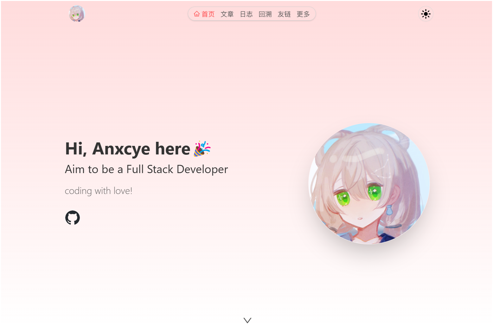
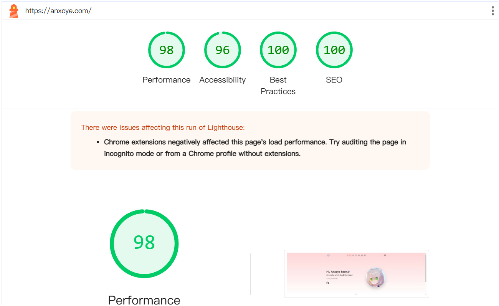

<center>
    <h1>ancy-blog</h1>
</center>

前后端分离的博客系统，使用 Docker Compose 快速部署。仍在测试中，可能会有问题，欢迎提交 issue。

项目前端使用了 `Vue3` 和 `TypeScript` 作为开发语言，在 UI 上使用了 `SCSS`、`TailwindCSS` 实现了响应式布局。组件库使用了 `Element Plus` （后台）和 `Ant Design Vue`（前台）。用`Vue Router` 实现了动态路由，根据后端返回的路由表动态生成菜单。

后端使用了 `Spring Boot3` 作为开发框架。并且使用 `Spring Security` 用经典的 RBAC 模型进行权限管理。 用 `MyBatis Plus` 作为 ORM 框架连接到 `MySQL` 数据库，通过 `Redis` 缓存。定时任务使用了 `Spring Schedule`来定期把 `Redis` 中的数据刷入到数据库中。

## 预览
- 前台 [Anxcye 小站](https://anxcye.com)
- 后台 [Anxcye 小站管理](https://admin.anxcye.com)



在 `LightHouse` 中拥有不错的得分：



## 部署项目
**先决条件**
- 一台 Linux 服务器
- 一个域名 example.com 用于前台
- 另一个域名 admin.example.com 用于后台
- 阿里云OSS（可选，用于存储图片）

### 部署过程
- 安装docker
```sh
curl -fsSL https://get.docker.com | bash -s docker
```

- 获取安装文件并解压
```sh
# 创建目录
mkdir ancy-blog && cd ancy-blog
# 获取最新版本
wget $(curl -s https://api.github.com/repos/Anxcye/ancy-blog/releases/latest | grep "browser_download_url.*tar.gz" | cut -d : -f 2,3 | tr -d \")
# 解压
tar -xzvf ancy.tar.gz
```

- 修改配置文件
```sh
# 进入项目目录
cd deploy
# 修改配置文件，相关配置注意事项见 .env 文件
vim .env
```

- 启动项目
```sh
docker compose up -d --build
```

现在项目已经部署完成，可以访问 `https://你的域名` 查看结果。
默认的超级管理员账号为 `ancy`，密码为 `1234`，请及时登录后台修改。

## 感谢
项目参考了 [Shiro](https://github.com/innei/shiro) 的 UI 设计，特此感谢。

以及 [admin/package.json](ancy-frontend/admin/package.json)、 [frontend/package.json](ancy-frontend/frontend/package.json) 和 [pom.xml](ancy-backend/pom.xml) 中使用的依赖，特此感谢。

